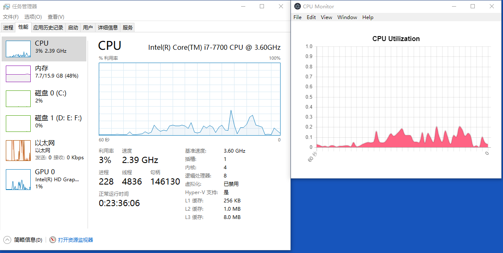

# CPU Monitor
## 简介
一款仿任务管理器的能够实时显示 CPU 利用率的 `electron` 桌面应用

## 运行方式
下载 `electron-v4.0.3-win32-x64` 的压缩包，解压之后在 `electron-v4.0.3-win32-x64` 的目录里执行以下命令：
```
start electron.exe {本项目的路径}
```

## 运行截图


## 参考资料
https://github.com/electron/simple-samples